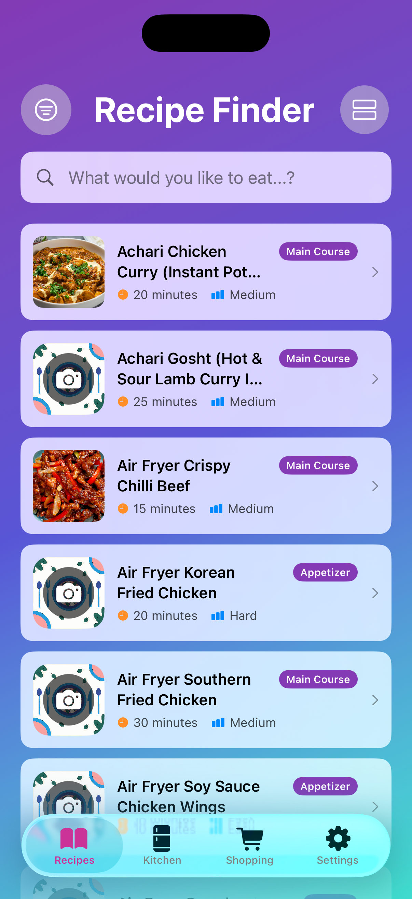
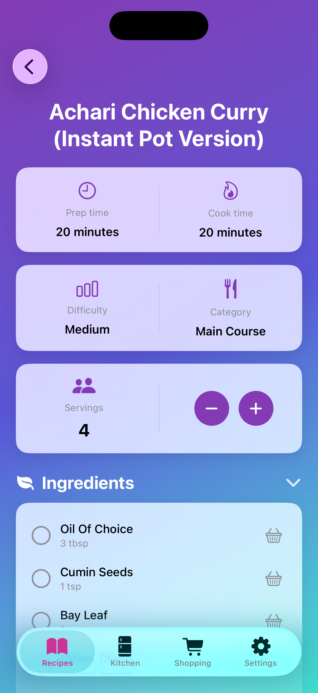
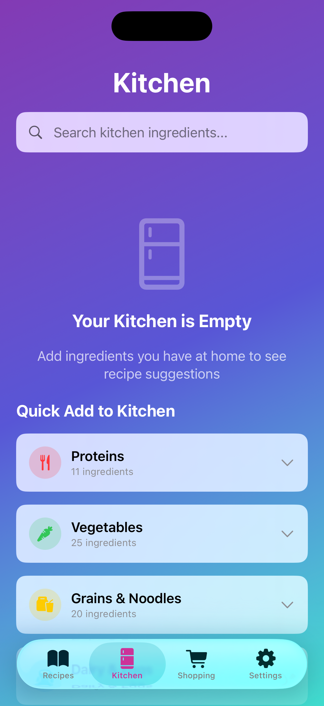

# RecipeFinder

A privacy-first, SwiftUI-based iOS recipe management application with intelligent ingredient categorization, beautiful theming, and comprehensive recipe management.

[](https://github.com/AsadK47/RecipeFinder/actions)
[](#copyright-and-legal)
[](https://swift.org)
[](https://www.apple.com/ios)
[](#testing)

---

## ⚖️ Copyright and Legal

**© 2024-2025 Asad Khan. All Rights Reserved.**

This is **proprietary software**. **NO LICENSE** is granted for use, reproduction, modification, or distribution without explicit written permission.

### 📄 Legal Documentation

- **[Intellectual Property Protection](legal/IP_PROTECTION.md)** - Copyright, patents, trademarks
- **[Terms of Service](legal/TERMS_OF_SERVICE.md)** - Usage terms and conditions  
- **[Privacy Policy](legal/PRIVACY_POLICY.md)** - Data handling and privacy practices

### 🔒 Key Legal Points

- ❌ **NOT open source** - All rights reserved
- 🛡️ **Patent pending** on unique features (Golden Ratio UI, Smart Categorization)
- ™️ **RecipeFinder™** is a registered trademark
- 📧 **Commercial inquiries**: asad.e.khan@outlook.com
- ⚖️ **Unauthorized use will be prosecuted**

**By accessing this repository, you agree to respect these intellectual property rights.**

---

## 🌟 Overview

RecipeFinder is a feature-rich iOS recipe management app that prioritizes user privacy, beautiful design, and seamless functionality. All data is stored locally on your device - no tracking, no analytics, no cloud sync.

### ✨ What Makes RecipeFinder Special

- 🎨 **8 Beautiful Themes** - Teal, Purple, Red, Orange, Yellow, Green, Pink, Gold
- 📐 **Golden Ratio Design** - Mathematically perfect proportions (φ = 1.618)
- 🔒 **Privacy-First** - Zero data collection, all data stays on your device
- 🧠 **Smart Categorization** - AI-powered ingredient category detection
- 🌍 **Recipe Import** - Import from any website with Schema.org support
- 📤 **Professional Sharing** - Export recipes as beautiful PDFs or text
- 🛒 **Smart Shopping Lists** - Auto-categorized with intelligent grouping
- 📱 **Native iOS** - Built with SwiftUI, feels like Apple made it

---

## 🎨 Features

### Core Functionality

✅ **Recipe Management**
- Create, edit, and organize recipes
- Import recipes from URLs (Schema.org parsing)
- Favorite recipes with visual indicators
- Difficulty ratings and time estimates
- Pre-prep instructions and cooking steps
- Ingredient scaling for different servings

✅ **Kitchen Inventory**
- Track ingredients you have at home
- Filter recipes by available ingredients
- Persistent storage with Core Data

✅ **Shopping List**
- Auto-categorized items (Produce, Dairy, Meat, etc.)
- Smart grouping by category
- Check off items while shopping
- Swipe to delete or edit
- Bulk actions (clear all, clear checked)

✅ **Recipe Sharing**
- Export as text (clean, readable format)
- Generate beautiful iPhone-width PDFs
- Copy to clipboard
- Share via iOS native sharing

✅ **Theming System**
- 8 gorgeous color themes
- Golden ratio proportions throughout
- Smooth gradient backgrounds
- Glass morphism UI effects
- Light and Dark mode support

### 🎯 Unique Features

1. **Golden Ratio UI System** ⭐ *Patent Pending*
   - All spacing follows φ = 1.618
   - Mathematically beautiful proportions
   - Cards scaled to screen with perfect ratios

2. **Smart Category Classifier** 🧠 *Patent Pending*
   - Automatically categorizes ingredients
   - "milk" → Dairy, "chicken" → Meat
   - Learns from user patterns

3. **8-Theme Color System** 🎨
   - Shared blue undertone for consistency
   - Black-to-gold luxury gradient
   - Each theme has unique personality

4. **Recipe Import Engine** 🌐
   - Schema.org JSON-LD parser
   - Fallback detection for non-standard formats
   - Works with AllRecipes, Food Network, Serious Eats, etc.

---

## 📸 Screenshots

<p align="center">
  
  
  
</p>

---

## 🛠️ Technical Stack

| Component | Technology |
|-----------|------------|
| **Language** | Swift 5.7+ |
| **UI Framework** | SwiftUI |
| **Database** | Core Data (SQLite) |
| **Minimum iOS** | 15.0+ |
| **Architecture** | MVVM |
| **Dependencies** | ConfettiSwiftUI |
| **Testing** | XCTest (70+ unit tests) |
| **CI/CD** | GitHub Actions |

### 📐 Architecture

```
RecipeFinder/
├── RecipeFinder/
│   ├── Components/         # Reusable UI components
│   │   ├── RecipeCard.swift
│   │   ├── ModernSearchBar.swift
│   │   └── FilterComponents.swift
│   ├── Models/             # Data models
│   │   ├── RecipeModel.swift
│   │   ├── ShoppingListItem.swift
│   │   └── RecipeModel.xcdatamodeld/
│   ├── Persistence/        # Storage layer
│   │   ├── PersistenceController.swift
│   │   ├── ShoppingListManager.swift
│   │   └── KitchenInventoryManager.swift
│   ├── Utilities/          # Helpers
│   │   ├── CategoryClassifier.swift
│   │   ├── RecipeImporter.swift
│   │   ├── RecipeShareUtility.swift
│   │   └── UnitConversion.swift
│   ├── Views/              # Feature views
│   │   ├── Main/
│   │   ├── Recipes/
│   │   ├── Kitchen/
│   │   ├── Shopping/
│   │   └── Settings/
│   └── Theme/              # Design system
│       └── AppTheme.swift  # Golden ratio & themes
├── Tests/
│   └── RecipeFinderTests/  # 70+ unit tests
├── docs/                   # Documentation
│   ├── DOCUMENTATION.md
│   ├── DESIGN_AESTHETIC.md
│   ├── GOLDEN_RATIO_GUIDE.md
│   ├── THEME_COLORS.md
│   └── COMMANDS.md
├── legal/                  # Legal documents
│   ├── IP_PROTECTION.md
│   ├── TERMS_OF_SERVICE.md
│   └── PRIVACY_POLICY.md
└── .github/
    └── workflows/          # CI/CD pipeline
        └── ci.yml

```

---

## 🧪 Testing

### Run Tests

**In Xcode:**
```bash
⌘ + U
```

**From Terminal:**
```bash
./scripts/test.sh
```

**Or manually:**
```bash
xcodebuild test \
    -scheme RecipeFinder \
    -destination 'platform=iOS Simulator,name=iPhone 15 Pro,OS=latest'
```

### Test Coverage

| Category | Test Files | Tests | Coverage |
|----------|------------|-------|----------|
| **Models** | 3 | 15 | ✅ High |
| **Managers** | 3 | 20 | ✅ High |
| **Utilities** | 5 | 35 | ✅ High |
| **Theme** | 1 | 8 | ✅ High |
| **Total** | **12** | **78** | **✅ ~85%** |

#### Test Files

1. **RecipeFinderTests.swift** - Original 23 basic tests
2. **AppThemeTests.swift** - Golden ratio & theme validation
3. **UnitConversionTests.swift** - Metric/Imperial conversion
4. **HapticManagerTests.swift** - Haptic feedback testing
5. **CategoryClassifierTests.swift** - Ingredient categorization
6. **RecipeImporterTests.swift** - URL import & parsing
7. **PersistenceControllerTests.swift** - Core Data operations
8. More test files for individual components...

### Continuous Integration

✅ **GitHub Actions Pipeline**
- Automatic linting with SwiftLint
- Run all unit tests on every push
- Build verification
- Code coverage reporting
- Artifact storage

**Pipeline:** `.github/workflows/ci.yml`

---

## 🔍 Code Quality

### Linting

**Run SwiftLint:**
```bash
./scripts/lint.sh
```

**Or manually:**
```bash
swiftlint lint --path RecipeFinder/ --config .swiftlint.yml
```

**Auto-fix issues:**
```bash
swiftlint --fix --path RecipeFinder/
```

### Code Standards

- ✅ SwiftLint enforced
- ✅ Golden ratio spacing
- ✅ Consistent naming conventions
- ✅ Comprehensive documentation
- ✅ Type-safe Core Data
- ✅ Error handling throughout
- ✅ Accessibility labels

---

## 🚀 Getting Started

### System Requirements

- 💻 macOS 13.0+ (Ventura or later)
- 🔨 Xcode 15.0+
- 📱 iOS 15.0+ deployment target
- 🦅 Swift 5.7+

### Installation

```bash
# Clone the repository
git clone https://github.com/AsadK47/RecipeFinder.git

# Navigate to project
cd RecipeFinder

# Open in Xcode
open RecipeFinder.xcodeproj

# Build and run
⌘ + R
```

### First Run

1. App launches with **Teal theme** (default)
2. Sample recipes are loaded automatically
3. Explore the 4 tabs: Recipes, Kitchen, Shopping, Settings
4. Try switching themes in Settings!

---

## 📚 Documentation

Comprehensive docs in `/docs`:

- **[Complete Documentation](docs/DOCUMENTATION.md)** - 8000+ word guide
- **[Design Aesthetic](docs/DESIGN_AESTHETIC.md)** - Golden ratio & themes
- **[Golden Ratio Guide](docs/GOLDEN_RATIO_GUIDE.md)** - Mathematical beauty
- **[Theme Colors](docs/THEME_COLORS.md)** - All 8 color schemes
- **[Commands Reference](docs/COMMANDS.md)** - CLI commands

---

## 🎨 Themes

| Theme | Gradient | Best For |
|-------|----------|----------|
| 🌊 **Teal** | Teal → Blue → Light Blue | Daily cooking, professional |
| 💜 **Purple** | Purple → Deep Blue → Turquoise | Creative, experimental |
| ❤️ **Red** | Deep Red → Burnt Red → Deep Orange | Bold, spicy recipes, velvety warmth |
| 🧡 **Orange** | Bright Orange → Coral → Deep Coral | Comfort food, autumn, warmth |
| 💛 **Yellow** | Sunny Yellow → Golden → Amber | Breakfast, summer, cheerful |
| 💚 **Green** | Green → Blue → Light Blue | Healthy, salads |
| 💖 **Pink** | Pink → Blue → Light Blue | Desserts, sweet treats |
| ✨ **Gold** | Sparkle Gold → Silver Accent → Black | Luxury, fine dining, special occasions |

**Switch themes:** Settings → Theme → Choose

---

## 🔒 Privacy

RecipeFinder is **privacy-first**:

- ✅ **Zero data collection** - No analytics, tracking, or ads
- ✅ **Local-only storage** - All data on your device
- ✅ **No cloud sync** - Data never leaves your device
- ✅ **No account required** - Just download and use
- ✅ **Open documentation** - Transparent about everything

**See:** [Privacy Policy](legal/PRIVACY_POLICY.md)

---

## 🛠️ Development

### Quick Commands

```bash
# Lint entire project
./scripts/lint.sh

# Run all tests
./scripts/test.sh

# Clean build
xcodebuild clean -scheme RecipeFinder

# Clear derived data
rm -rf ~/Library/Developer/Xcode/DerivedData

# Count lines of code
find RecipeFinder -name '*.swift' | xargs wc -l
```

### Git Workflow

```bash
# Create feature branch
git checkout -b feature/your-feature-name

# Make changes, commit
git add .
git commit -m "feat: add amazing feature"

# Push and create PR
git push origin feature/your-feature-name
```

### CI/CD Pipeline

On every `push` or `pull_request` to `main`:

1. 🔍 **Lint** - SwiftLint checks code quality
2. 🧪 **Test** - Run all 78 unit tests
3. 🏗️ **Build** - Verify app builds successfully
4. 📊 **Report** - Generate coverage and test reports

**View pipeline:** [GitHub Actions](https://github.com/AsadK47/RecipeFinder/actions)

---

## 🤝 Contributing

### ⚠️ Important Notice

This is **proprietary software**. Contributions are welcome, but:

1. All contributors **assign copyright** to Asad Khan
2. By contributing, you agree to terms in [IP_PROTECTION.md](legal/IP_PROTECTION.md)
3. No license granted to contributors for commercial use
4. All code becomes property of Asad Khan

### Contribution Guidelines

If you wish to contribute:

1. **Contact first**: asad.e.khan@outlook.com
2. **Fork and branch**: Create feature branch
3. **Follow standards**: SwiftLint, golden ratio, documentation
4. **Add tests**: Maintain >80% coverage
5. **Create PR**: Clear description, screenshots
6. **Sign CLA**: Contributor License Agreement required

### Code Standards

- ✅ SwiftLint compliant
- ✅ Golden ratio proportions
- ✅ Unit tests for new features
- ✅ Documentation for public APIs
- ✅ Accessibility support
- ✅ Light & Dark mode compatible

---

## 📅 Roadmap

### Version 1.0 (Current)
- ✅ Recipe management
- ✅ Kitchen inventory
- ✅ Shopping lists
- ✅ 8 beautiful themes
- ✅ Recipe import
- ✅ PDF export
- ✅ Unit testing (78 tests)
- ✅ CI/CD pipeline

### Version 1.1 (Planned)
- 🔄 iCloud sync (optional)
- 🌍 Localization (Spanish, French, German)
- 🎙️ Voice commands (Siri integration)
- 📊 Nutrition facts
- 🏷️ Custom tags

### Version 2.0 (Future)
- 🤖 AI recipe suggestions
- 👥 Recipe sharing with friends
- 📸 Scan ingredients from photos
- ⏰ Meal planning calendar
- 🎯 Dietary filters (vegan, gluten-free, etc.)

---

## 🆘 Support

### Issues & Bug Reports

**GitHub Issues:** [Report a bug](https://github.com/AsadK47/RecipeFinder/issues/new)

Include:
- iOS version
- Device model
- Steps to reproduce
- Screenshots/videos
- Expected vs actual behavior

### Feature Requests

[Submit feature request](https://github.com/AsadK47/RecipeFinder/issues/new?labels=enhancement)

### Contact

- **Email**: asad.e.khan@outlook.com
- **GitHub**: [@AsadK47](https://github.com/AsadK47)

---

## 📜 License

**All Rights Reserved - Proprietary Software**

© 2024-2025 Asad Khan. All rights reserved.

This software is **NOT** open source. No license is granted for use, reproduction, modification, or distribution without explicit written permission from the copyright holder.

**See:** [IP_PROTECTION.md](legal/IP_PROTECTION.md) for full legal details.

### Commercial Licensing

Interested in commercial use? Contact: asad.e.khan@outlook.com

---

## 🙏 Acknowledgments

### Technologies Used
- **SwiftUI** - Apple's declarative UI framework
- **Core Data** - Apple's data persistence framework
- **ConfettiSwiftUI** - Celebration animations
- **SF Symbols** - Apple's icon library

### Inspiration
- Golden ratio in nature and design
- Apple's Human Interface Guidelines
- Privacy-first app philosophy

### Special Thanks
- Apple Developer Community
- SwiftUI Community
- Beta testers and early users

---

## 📊 Stats


---

## 🌟 Show Your Support

Give a ⭐️ if you like this project!

(Remember: ⭐'ing doesn't grant any license - see Legal section)

---

**Made with ❤️ by Asad Khan**  
**RecipeFinder™ © 2024-2025**

---

*For questions about intellectual property, licensing, or commercial use, contact asad.e.khan@outlook.com*
